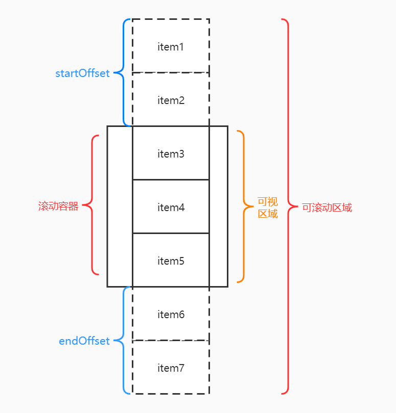
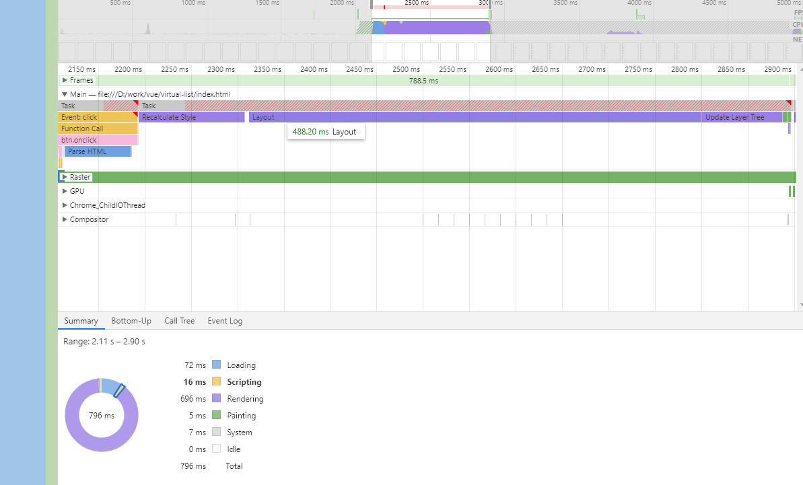

# 前端优化之虚拟列表

在我们日常开发中，列表形态的数据展示是很经常碰到的一个需求，对于数据量很大的列表，我们通常不会全部渲染出来，而是通过分页或是无限滚动分页的方式来加载数据，这样同时展示数据不多，渲染压力也小。但有时也需要将数据全部渲染出来的场景，例如某个用户有1000条交易数据需要在客户端全部展示，那么这种场景下我们该如何优化列表数据的展示呢？

如果是这种场景，就可以用到我们今天要介绍的主角 **虚拟列表**

## 什么是虚拟列表

在正文之前，先对虚拟列表做个简单的定义。

虚拟列表是按需渲染的一种实现，相对的无限滚动分页是延迟渲染（即懒加载）的一种实现。虚拟列表通过在**滚动容器的可视区域中，渲染长列表数据中的某一部分数据**来实现长列表数据渲染优化的目的。

简而言之，虚拟列表就是指**可视区域渲染**的列表，其中有三个概念需要了解一下：

* **滚动容器元素**： 一般情况下，滚动容器元素是`window`对象，但我们可以通过布局的方式，在页面中指定一个或者多个的滚动容器元素。只要某个元素能在内部产生横向或者纵向的滚动，这个元素就是滚动元素。在本文中我们只讨论元素的纵向滚动。
* **可滚动区域**： 滚动容器内部内容区域。假设有1000条数据，每条数据高度20，那么可滚动的区域高度就是`1000*20`。可滚动区域当前的具体高度一般可以通过滚动容器元素的`scrollHeight`属性获取。用户可以通过滚动来改变列表在可视区域的显示部分。
* **可视区域**： 滚动容器的视觉可见区域，如果容器时window对象，那么可视区域就是浏览器的视口大小，如果容器是某一个div元素，其高度是300，右侧有纵向的滚动条可以滚动，那么视觉可见区域就是div的可视区域。

实现虚拟滚动列表，就是在处理用户滚动时改变列表在可视区域的渲染部分，其步骤如下：

* 计算可见区域内数据的startIndex
* 计算可见区域内数据的endIndex
* 根据startIndex和endIndex截取数据，并渲染到页面中
* 根据statIndex对应的数据在列表中的偏移位置计算startOffset，并设置到列表上
* 根据endIndex对应的数据相对于可滚动区域最底部的偏移位置计算endOffset，并设置到列表上

结合下面这张图大家理解一下上述步骤：

;

## 为什么需要虚拟列表 

虽然前文讲过，需要用虚拟列表来优化大数据列表的展示，但对于为什么要用，可能有一些同学还是会感到疑问。我们来试试看不使用虚拟列表优化会出现什么问题。

我们用代码先生成一个 10000条的数据。然后在点击按钮的时候将这10000条数据插入到页面中，看看会发生什么。

```js
const btn = document.getElementById("btn");
const container = document.getElementById("container");
const data = new Array(10000).fill(0).map((_, i) => `this is content ${i}`);

btn.onclick = () => {
  const innerHTML = data.map((t, i) => `<div><p>${i}</p>${t}<p>some thing...</P></div>`).join("");

  container.innerHTML = innerHTML;
};
```
点击按钮后会明显的感到卡顿，通过chrome的performance分析可以看到这次的渲染用了将近800毫秒的时间，这还是只有简单数据的情况下，实际项目中一个item要展示的内容会比我们的示例复杂的多。


## 实现一个虚拟列表

通过上面这个测试我们可以知道，如果在渲染大数据列表的时候不加以优化，对用户的使用体验来说是很糟糕的，那么如何去实现一个虚拟列表呢？下面还是通过一个小例子来展开。

### 实现一个固定高度虚拟列表

我们先实现一个简单的固定高度的虚拟列表，在这个基础上我们在实现一个不定高度的虚拟列表。

```js

````